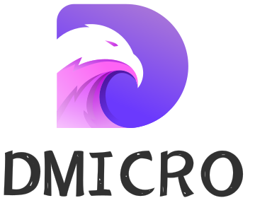

<div align="center">

<h4>让你的Golang开发无比简单</h4>

[](https://github.com/osgochina/dmicro/releases)
[](http://goreportcard.com/report/osgochina/dmicro)
[](https://github.com/osgochina/dmicro/issues?q=is%3Aopen+is%3Aissue)
[](https://github.com/osgochina/dmicro/issues?q=is%3Aissue+is%3Aclosed)
[](http://godoc.org/github.com/osgochina/dmicro)
[](https://github.com/osgochina/dmicro/tree/main/examples)
[](https://www.murphysec.com/dr/JycJlZcX36soO749SO)

</div>

## 概述

`DMicro`是一个高效、可扩展且简单易用的微服务框架。包含`DRPC`,`DServer`等多个组件。

其中`DRPC`组件是rpc框架，使用`endpoint`作为统一对象，为`RPC Server`，`RPC Clinet`提供统一的API封装。

`DRPC`组件特性：
* 易于理解，科学合理的多层抽象。
    * `endpoint`,`session`,`handle`,`message`,`protoco`,`codec`,`transfer filter`,`plugin`.
* 支持常见的消息通讯协议`json`，`prototbuf`,`http`,`jsronrpc`,良好的抽象层让自定义消息协议变得简单快捷。
* 支持多种网络协议`tcp`,`unix`,`kcp`,`quic`,`websocket`等。。。
* 全生命周期的插件埋点(多达27个埋点),让插件系统能实现的功能丰富多彩。
    * 内置 `auth`,`heartbeat`，`ignorecase`,`proxy`,`securebody`等插件
* 依托丰富的插件埋点，抽象出易于使用的`Event`事件系统，让你的开发如虎添翼。
* 高性能的网络传输层，让性能不再是瓶颈。
* 客户端自动重拨。
* 配合`DServer`组件，实现优雅的平滑重启，让你的服务时刻在线。
* 配合`Registry`组件，实现服务注册。
    * `Registry`组件抽象出合理的接口，方便接入多个服务注册中心，目前已实现`etcd`,`mdns`。
* 配合`Selector`组件实现`服务发现`功能。

`DServer`应用管理组件帮助大家封装好了应用的全生命周期管理。

`DServer`组件特性：

* 采用`server`,`service`,`sandbox`三层结构。 让业务专注于`sandbox`层，支持单进程，多进程模式。做到开发debug单进程，运行单/多进程可选。
* 完善合理的启动命令封装，支持`start`,`stop`，`reload`,`ctl`等命令。
* 不但支持`drpc`组件，还支持`ghttp`等实现平滑重启接口的其他组件(如果不需要平滑重启，所有服务组件都支持)
* 好用的命令行管理功能，让你能实时的管理正在运行的应用。
* 完善的进程管理组件`supervisor`,支持对进程的全生命周期管理。

[详细文档]( https://osgochina.gitee.io/dmicro)


## 安装

```shell
go get -u -v github.com/osgochina/dmicro
```

推荐使用 `go.mod`:
```
require github.com/osgochina/dmicro latest
```

* import

```go
import "github.com/osgochina/dmicro"
```

## 限制
```shell
golang版本 >= 1.16
```

## 使用`DServer`创建`rpc`服务

如何快速的通过简单的代码创建一个真正的rpc服务。
以下就是示例代码：
```go
// rbc_server.go
package main

import (
	"fmt"
	"github.com/osgochina/dmicro/drpc"
	"github.com/osgochina/dmicro/dserver"
	"github.com/osgochina/dmicro/logger"
)
// DRpcSandBox  默认的服务
type DRpcSandBox struct {
	dserver.BaseSandbox
	endpoint drpc.Endpoint
}

func (that *DRpcSandBox) Name() string {
	return "DRpcSandBox"
}

func (that *DRpcSandBox) Setup() error {
	fmt.Println("DRpcSandBox Setup")
	cfg := that.Config.EndpointConfig(that.Name())
	cfg.ListenPort = 9091
	cfg.PrintDetail = true
	that.endpoint = drpc.NewEndpoint(cfg)
	that.endpoint.RouteCall(new(Math))
	return that.endpoint.ListenAndServe()
}

func (that *DRpcSandBox) Shutdown() error {
	fmt.Println("DRpcSandBox Shutdown")
	return that.endpoint.Close()
}


// Math rpc请求的最终处理器，必须集成drpc.CallCtx
type Math struct {
	drpc.CallCtx
}

func (m *Math) Add(arg *[]int) (int, *drpc.Status) {
	// test meta
	logger.Infof("author: %s", m.PeekMeta("author"))
	// add
	var r int
	for _, a := range *arg {
		r += a
	}
	// response
	return r, nil
}

func main() {
	dserver.Authors = "osgochina@gmail.com"
	dserver.SetName("DMicro_drpc")
	dserver.Setup(func(svr *dserver.DServer) {
		err := svr.AddSandBox(new(DRpcSandBox))
		if err != nil {
			logger.Fatal(err)
		}
	})
}

```

- 编译
```shell
$ go build rbc_server.go
```

- 运行

```shell
$ ./rbc_server start
```


## 创建普通`rpc`客户端

服务已经建立完毕，如何通过client链接它呢？

```go

package main

import (
	"github.com/osgochina/dmicro/drpc"
	"github.com/osgochina/dmicro/drpc/message"
	"github.com/osgochina/dmicro/logger"
	"time"
)

func main() {

	cli := drpc.NewEndpoint(drpc.EndpointConfig{PrintDetail: true, RedialTimes: -1, RedialInterval: time.Second})
	defer cli.Close()
	

	sess, stat := cli.Dial("127.0.0.1:9091")
	if !stat.OK() {
		logger.Fatalf("%v", stat)
	}
    var result int
    stat = sess.Call("/math/add",
        []int{1, 2, 3, 4, 5},
        &result,
        message.WithSetMeta("author", "liuzhiming"),
    ).Status()
    if !stat.OK() {
        logger.Fatalf("%v", stat)
    }
    logger.Printf("result: %d", result)
}
```
通过以上的代码事例，大家基本可以了解`drpc`框架是怎么使用。

## `ctl`命令

使用`ctl`命令管理正在运行的`server`

- 打开新的命令行窗口运行`ctl`命令

```shell
$ ./rbc_server.exe ctl

  ____    ____
 |  _ \  / ___|    ___   _ __  __   __   ___   _ __ 
 | | | | \___ \   / _ \ | '__| \ \ / /  / _ \ | '__|
 | |_| |  ___) | |  __/ | |     \ V /  |  __/ | |   
 |____/  |____/   \___| |_|      \_/    \___| |_|  
Version:         No Version Info
Go Version:      No Version Info
DMicro Version:  v1.0.0
GF Version:      v1.16.9
Git Commit:      No Commit Info
Build Time:      No Time Info
Authors:         osgochina@gmail.com
Install Path:    D:\code\GolandProjects\dmicro\examples\simple_dserver\rbc_server.exe
DMicro_drpc »

```
- 运行`help`命令，获取命令说明

```shell
DMicro_drpc » help

好用的服务管理工具

Commands:
=========
  clear             clear the screen
  debug             debug开关
  exit              exit the shell
  help              use 'help [command]' for command help
  info, status, ps  查看当前服务状态
  log               打印出服务的运行日志
  reload            平滑重启服务
  start             启动服务
  stop              停止服务
  version, v        打印当前程序的版本信息

DMicro_drpc »
```

## TODO
- [x] `Registry` 服务注册
- [x] `Selector` 服务发现
- [x] `Eventbus` 事件总线
- [x] `Supervisor` 进程管理
- [ ] `Code gen` 代码生成
- [ ] `Tracing` 链路追踪
- [x] `Metrics` 指标统计
- [ ] `Broker` 限流熔断
- [ ] `OpenAPI` 文档自动生成

## 获取帮助

* 你可以阅读[`DMicro`文档](https://osgochina.gitee.io/dmicro/)，
* 微信交流群: 扫码或者微信添加`osgochina`备注`DMicro`加群。

| 添加好友后拉群 |
|---------|
|    |


## 感谢

`DMicro`该项目的诞生离不开`erpc`和`GoFrame`两个优秀的项目。

其中`drpc`组件参考`erpc`项目的架构思想，依赖的基础库是`GoFrame`。

* [erpc](https://github.com/henrylee2cn/erpc)
* [GoFrame](https://github.com/gogf/gf)