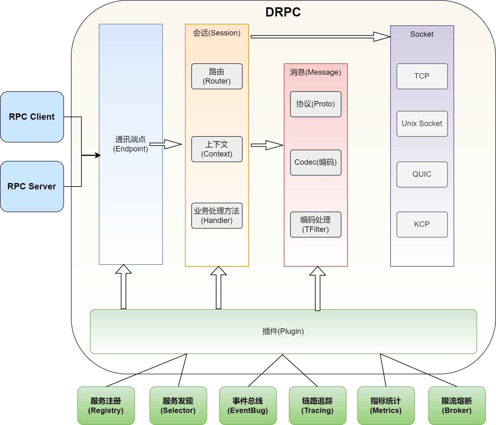
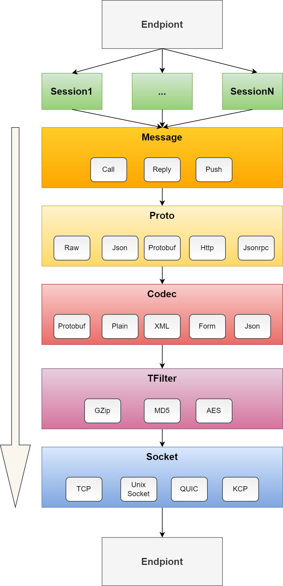
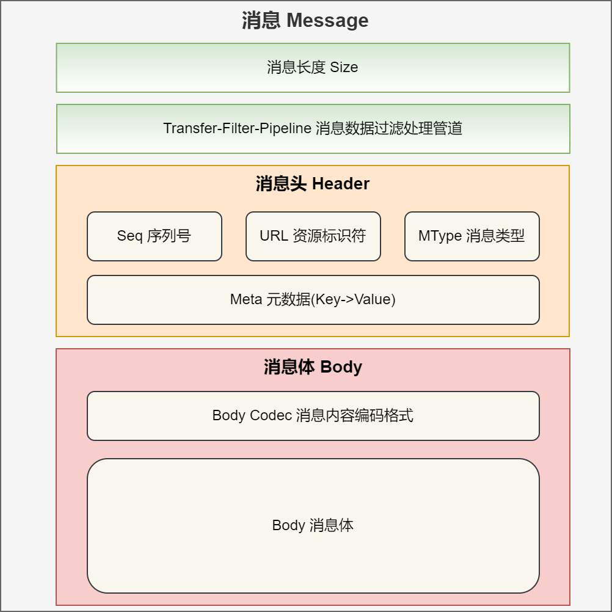
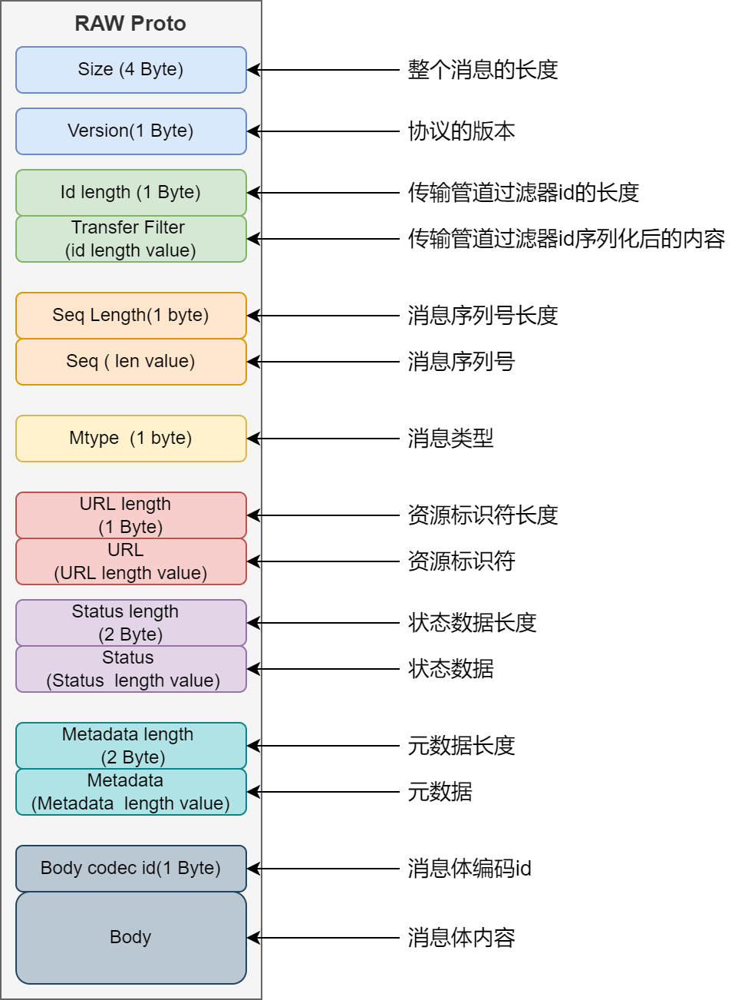
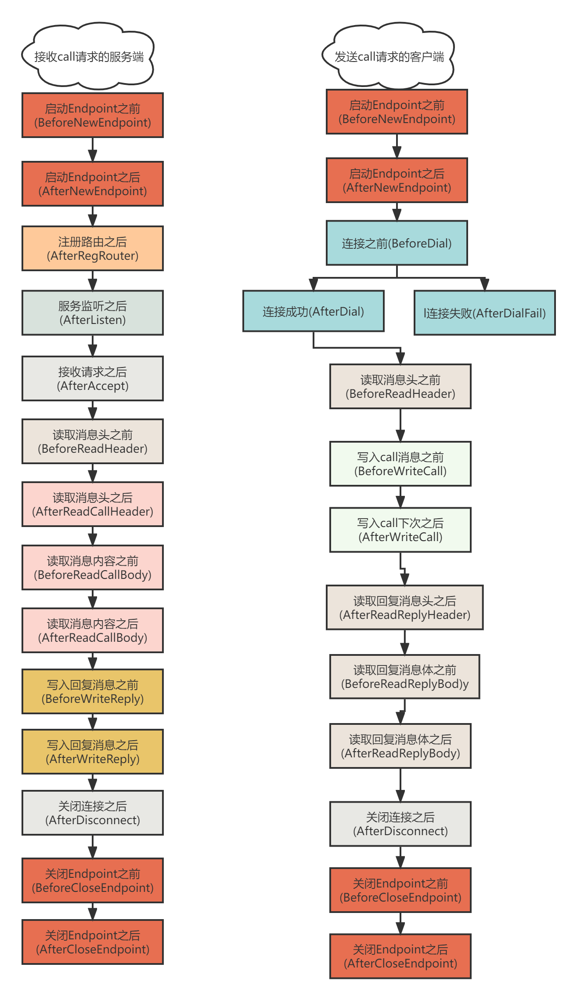

# Go 微服务开发框架`DMicro`的设计思路

`DMicro`源码地址:

- GitHub: [https://github.com/osgochina/dmicro](https://github.com/osgochina/dmicro)
- Gitee: [https://gitee.com/osgochina/dmicro](https://gitee.com/osgochina/dmicro)


## 背景

`DMicro`诞生的背景，是因为我写了10来年的PHP，想在公司内部推广`Go`,公司内部的组件及rpc协议都是基于`swoole`定制化开发的。调研了市面上的各种框架，包括`beego`,`goframe`,`gin`,`go-micro`,`go-zero`,`erpc`等等，可能是我当时技术能力有限，并不能让这些框架很好的适配我们的业务。

我们业务开发有几个痛点，在当时`golang`的生态中无法找到一整套解决方案。

- 微服务应用和单体应用同时开发。
- 高性能，高可用的网络通讯。
- 需要自定义应用层的协议(重点)。
- 需要灵活的插件扩展机制，方便适配现有系统(重点)。
- 服务端与客户端的概念模糊，互相都能使用相同的api调用对方。
- 支持Push消息。
- 连接/会话管理。
- 高效率的开发，支持通过proto生成代码。
- 支持多种网络协议，`tcp`,`websocket`,`quic`,`unixsocket`.
- 兼容http协议。
- 能够更快速的定位问题。
- 更便捷的增加新特性。

在对常用的开源框架做了简单的调研以后，发现并没有一款合适的框架能满足我的所有需求。在认真思考过后，发现`erpc`和`goframe`两个框架的结合体能满足我的需求，于是就诞生了自研`DMicro`.


## 概述

`DMicro`中的`drpc`组件的思想是参考`erpc`实现，甚至可以说是它的继承者。

`drpc`组件是`DMicro`框架的一部分，为了适配`DMicro`框架，在`erpc`的基础上做了深入的扩展开发。

整个`DMicro`大量使用`goframe`中的组件，如果业务使用`goframe`框架，可以无缝接入。


`DRpc`特性列表:

- `对等通信`,`对等Api`
- `高性能`,`非阻塞异步IO`
- `自定义Proto`,,`兼容http协议`,`自定义Codec`
- `Hook点`,`插件系统`,
- `Push消息`,`session管理`，`Socket抽象`,
- `断线重连`,`过载保护`,`负载均衡`,`心跳机制`,
- `平滑重启` `...`

`DServer`特性列表：

- `快速构建`,`平滑重启`,`多进程支持`,`单/多进程一致`
- `预定义命令行`,`ctl命令管理服务`
- `可观测`,`可控制`,`应用沙盒`

`DMicro`已经内置组件：

- [x] `Registry` 服务注册
- [x] `Selector` 服务发现
- [x] `Eventbus` 事件总线
- [x] `Supervisor` 进程管理
- [ ] `Code gen` 代码生成
- [ ] `Tracing` 链路追踪
- [ ] `Metrics` 统计告警
- [ ] `Broker` 限流熔断
- [ ] `OpenAPI` 文档自动生成


## 架构


### 设计理念

对`DMicro`框架的设计，从设计之初就是在追求灵活性，适应性。在保证微服务的稳定性前提下，追求项目的开发效率。

* 面向接口设计，保证代码稳定，提供灵活定制。
* 抽象各组件的接口，高内聚，低耦合。
* 分层设计，自上而下逐层封装，利于稳定和维护。
* 高性能，高可用，低消耗。
* 对开发友好，封装复杂度。
* 提供丰富的组件及功能，让开发专注业务。

无数个写`DMicro`的日夜，我都谨记开发三原则:
- `Clarity(清晰)`
- `Simplicity(简单)`
- `Productivity(生产力)`

无论工作，还是做开源项目，都应该保持这三个原则，养成良好的习惯。

### 面向接口设计

`DMicro`秉承着万物皆接口的原则,提供框架无与伦比的扩展性.

下图展示的是消息的发送的流转流程,可以看到,所有的功能点都被抽象成了接口,每个功能点都提供了不同的实现.



#### 会话 Session

大多数的`Rpc`框架并不强调会话(`session`)的概念,因其应用场景不需要用到会话(`session`).
那么`drpc`为什么需要抽象出会话(`session`)呢?

- `Endpoint` 融合了`Client`和`Server`,需要提供相同的`Api`.
- `服务端`需要主动向`客户端`发送消息,并且获取客户端的响应.
- `服务端`支持对`多个客户端`批量发送消息.
- 异步主动断开`一个`或`多个`会话.
- 获取会话底层的`文件描述符`,对其进行性能调优.
- 可以为每个会话绑定特殊的`数据/属性`.

`Session`抽象了整个`drpc`框架的会话,把`Socket`,`Message`,`Context`都融合到一起.
开发者只需要对`session`进行操作,就能实现大多数需求.

- 获取连接信息
- 控制连接的生命周期(超时时间)
- 控制单次请求的生命周期(超时时间)
- 接收消息
- 发送消息
- 创建消息的上下文
- 绑定会话的相关信息(如用户信息)
- 断线重连
- 主动断开会话.
- 健康检查
- 获取连接关闭事件
- 为会话设置单独的id

`Session`接口可以细分为4个`interface{}`,分别是`EarlySession`,`BaseSession`,`CtxSession`,`Session`.
对应的是应用的不同生命阶段会话(`Session`)拥有的不同属性.

- `EarlySession` 表示刚生成会话,尚未启动 goroutine 读取数据的阶段.
- `BaseSession`  只有最基础的方法,用于关闭连接时候的插件参数.
- `CtxSession`   在处理程序上下文中传递的会话对象.
- `Session`      全功能的会话对象.

正常情况下,开发者用到的都是`Session`,`CtxSession`这两个接口,其他2个接口是在插件中使用.

#### 消息 `Message`

消息`Message` 包含消息头`Header`,消息体`Body`,是客户端与服务端之间通信的实体.

`Message interface{}` 抽象了对通信实体的操作.

- `Size`消息的长度
- `Transfer-Filter-Pipeline` 报文数据过滤处理管道
- `Seq` 序列号
- `MType` 消息类型
- `ServiceMethod` 资源标识符
- `Meta` 消息的元数据
- `BodyCodec` 消息体编码格式
- `Body` 消息体



#### 协议 Proto

协议是对`消息Message`对象的序列化和反向序列化,框架提供`Proto` 接口.
只需要实现该接口,开发者就能定制符合业务需求的自定义协议,从而提升了框架的灵活性.

接口的定义如下:

```go
type Proto interface {
	Version() (byte, string)
	Pack(Message) error
	Unpack(Message) error
}
```

- `Version()` 返回该协议的id和名字,两个组成唯一的版本号.
- `Pack` 对消息`Message`对象进行序列化.
- `Unpack` 对字节流反序列化,生成一个消息`Message`对象.

目前框架已支持`Http`,`Json`,`Raw`,`Protobuf`,`JsonRpc`这5个协议.

`RAW`协议组成如下:



其他协议可以参考代码.


#### 编码 Codec

作为一个通用性的框架,支持的协议可以有多种,消息体的编解码也可以有多少种.
`drpc`使用`Codec`接口对消息体Body进行编解码.

接口的定义如下:

```go
type Codec interface {
	ID() byte
	Name() string
	Marshal(interface{}) ([]byte, error)
	Unmarshal([]byte, interface{}) error
}
```

- `ID` 返回编解码器的id
- `Name` 返回编解码器的名字,名字是为了开发者更容易识别.
- `Marshal` 对消息内容进行编码
- `Unmarshal` 对消息内容进行解码

目前框架已支持`Form`,`Json`,`plain`,`Protobuf`,`XML`这5个编解码.

#### 连接 Socket

`Socket`扩展了`net.Conn`,并且抽象出接口,方便框架对底层网络协议的集成.

`Socket`接口实现了一部分`Session`接口的功能,`Session`接口调用的一些方法,实际上是转发调用了`Socket`中的方法.

这样的分层实现,让`Socket`拥有的集成其他协议的能力.

- `TCP V4`,`TCP V6`
- `Unix Socket`
- `KCP`
- `QUIC`

支持对连接的性能调优.

- `SetKeepAlive` 开启链接保活
- `SetKeepAlivePeriod` 链接保活间隔时间
- `SetReadBuffer` 设置链接读缓冲区长度
- `SetWriteBuffer` 获取链接写缓冲区长度
- `SetNoDelay` 开启关闭no delay算法
- `ControlFD` 支持操作链接的原始句柄


### 有机的组合

前面讲到,`DMicro`框架万物皆接口,分层+接口的设计,让`DMicro`有了灵活的组成高效且符合业务实际情况的能力.

接下来我们要讲到实现这些能力的基础.插件系统.

#### 插件 Plugin

插件系统给框架带来了极大的扩展性和灵活性，是整个框架的一个灵魂模块，有了它，框架就有了无限可能。

什么样的插件系统才能算是优雅呢？我能想到的有以下几点：

- 合理且丰富的`hook`位置,能够覆盖整个框架的生命周期，贯穿通讯的各个环节。
- 每个`hook`位置的入参和出参都是经过精心设计。
- 每个插件都能够使用多个`hook`位置，每个`hook`位置都能被多个插件使用。
- 设计的足够简洁，优雅。能方便的进行二次开发定制。

在`drpc`中，钩子贯穿与整个`Endpoint`的生命周期，是它不可或缺的重要一环。



通过这些`钩子 Hook`点,赋予了插件无限可能.

#### 组件

有了插件,就能通过插件的组合,编写综合功能的组件,目前框架提供一些内置的组件,
- `服务端 Rpc Server`
- `客户端 Rpc Client`
- `服务注册 Registry`
- `服务发现 Selector`
- `事件总线 EventBus`
- `进程管理 Supervisor`

即将提供:
- `链路追踪 Tracing`
- `统计告警 Metrics`
- `限流熔断 Broker`.

限于篇幅的原因,具体组件的实现,这里就不深入讲解,请关注后续的文章.


## 未来展望

如果把`DMicro`比作人生,现在成长的阶段还处在少年时期,只完成了基础的架构设计和一部分组件的开发.

接下来的方向主要是往易用性和可靠性方向发展.

易用性:

- 项目效能工具`dmctl`工具的开发,包括代码生成,项目结构生成,打包,编译等等功能.
- 符合openapi定义的文档组件的开发.
- 更加完善的文档和使用示例.

可靠性:

- 可观测性
    - 链路追踪
    - 指标信息
    - 日志流
- 生产可用
    - 测试用例的完善
    - 代码覆盖率
    - 性能调优

希望`DMicro`能在大家的呵护及鞭策下茁长成长.

开源不易,需要更多小伙伴加入,共创`DMicro`.
如果你希望使用`DMicro`,赶快引入代码,搭建你的第一个新项目吧!
如果你也想为`DMicro`生态添砖加瓦,赶快`Fork`代码,给我们提交`pr`吧!