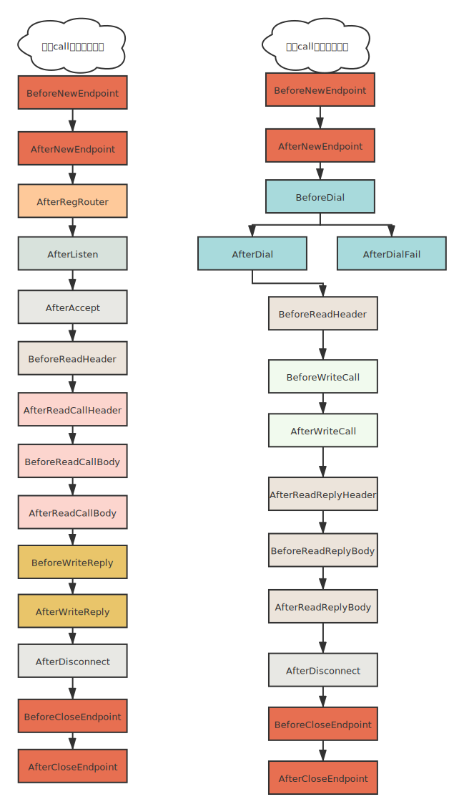
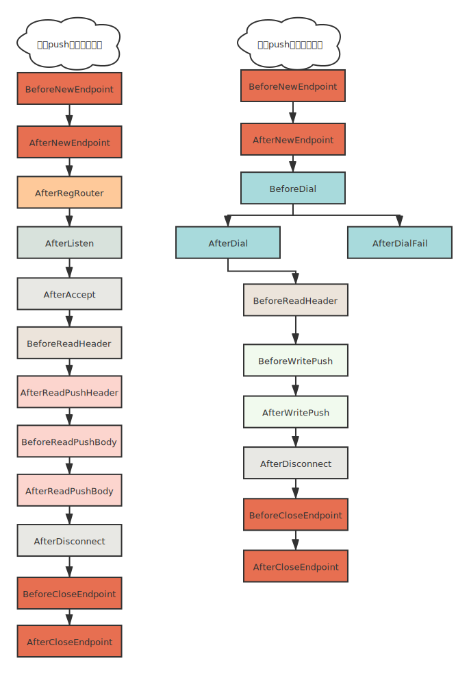

### 概念

在`drpc`中，钩子贯穿与整个`Endpoint`的生命周期，是它不可或缺的重要一环。


### 钩子与插件的关系

在`drpc`中的钩子预先埋在了Endpoint运行的各个阶段，
具体的高级功能实现需要配合`插件`，组合后才能形成真正的功能。


插件是使用多个`钩子`有逻辑的组合形成的实现特定功能的一种机制，整个`drpc`的插件都离不开插件机制。

比如`ignoreCase`插件，就使用`AfterReadCallHeader`,`AfterReadPushHeader`两个钩子，来修改请求的`ServiceMethod`，把它转换成全小写,
从而达到忽略大小写的效果。

### Endpoint生命周期钩子图

因为`Endpoint`是支持同时有多个角色，即能作为服务端，也能作为客户端，并且支持`Call`,`Push`两种消息。所以它的钩子触发流程也是多种多样的。

这里我帮大家单独整理出来`Endpoint`作为单一角色时候的流程图。

#### 接收call请求的服务端和发送call请求的客户端



#### 接收push请求的服务端和发送push请求的客户端



### Endpoint生命周期中会触发的钩子列表

#### `BeforeNewEndpoint`

> 创建Endpoint之前触发该钩子

在创建endpoint之前触发该钩子。参数为`EndpointConfig`可以在该钩子正查看，修改配置信息。

```go
BeforeNewEndpoint(*EndpointConfig, *PluginContainer) error
```

#### `AfterNewEndpoint`

> 创建Endpoint之后触发该钩子
```go
AfterNewEndpoint(EarlyEndpoint) error
```

创建Endpoint之后触发该钩子。参数为`EarlyEndpoint`接口，该接口具体定义可以参考源码。

#### `BeforeCloseEndpoint`

> 关闭Endpoint之前触发该钩子

```go
BeforeCloseEndpoint(Endpoint) error
```

#### `AfterCloseEndpoint`

> 关闭Endpoint之后触发该钩子

```go
AfterCloseEndpoint(Endpoint, error) error
```

#### `AfterRegRouter`

> 路由注册成功触发该钩子

```go
AfterRegRouter(*Handler) error
```

#### `AfterRegRouter`

> 服务端监听以后触发该钩子

```go
AfterListen(net.Addr) error
```

#### `BeforeDial`

> 作为客户端链接到服务端之前调用该钩子

```go
BeforeDial(addr string, isRedial bool) *Status
```

#### `AfterDial`

> 作为客户端链接到服务端成功以后触发该钩子

```go
AfterDial(sess EarlySession, isRedial bool) *Status
```

#### `AfterDialFail`

> 作为客户端链接到服务端失败以后触发该钩子

```go
	AfterDialFail(sess EarlySession, err error, isRedial bool) *Status
```

#### `AfterAccept`

> 作为服务端，接收到客户端的链接后触发该钩子

```go
AfterAccept(EarlySession) *Status
```


#### `BeforeWriteCall`

> 写入CALL消息之前触发该钩子

```go
BeforeWriteCall(WriteCtx) *Status
```

#### `AfterWriteCall`

> 写入CALL消息成功之后触发该钩子

```go
AfterWriteCall(WriteCtx) *Status
```


#### `BeforeWriteReply`

> 写入Reply消息之前触发该钩子

```go
BeforeWriteReply(WriteCtx) *Status
```

#### `AfterWriteReply`

> 写入Reply消息成功之后触发该钩子

```go
AfterWriteReply(WriteCtx) *Status
```

#### `BeforeWritePush`

> 写入PUSH消息之前触发该钩子

```go
BeforeWritePush(WriteCtx) *Status
```

#### `AfterWritePush`

> 写入PUSH消息成功之后触发该钩子

```go
	AfterWritePush(WriteCtx) *Status
```

#### `BeforeReadHeader`

> 执行读取Header之前触发该钩子

客户端，服务端在readMessage之前都会执行该钩子，然后才会阻塞读等待，等待消息到达，不是说消息到了后才触发该钩子。

```go
BeforeReadHeader(EarlyCtx) error
```

#### `AfterReadCallHeader`

> 读取CALL消息的Header之后触发该钩子

```go
AfterReadCallHeader(ReadCtx) *Status
```


#### `BeforeReadCallBody`

> 读取CALL消息的body之前触发该钩子

```go
BeforeReadCallBody(ReadCtx) *Status
```

#### `AfterReadCallBody`

> 读取CALL消息的body之后触发该钩子

```go
AfterReadCallBody(ReadCtx) *Status
```

#### `AfterReadPushHeader`

> 读取PUSH消息Header之后触发该钩子

```go
AfterReadPushHeader(ReadCtx) *Status
```

#### `BeforeReadPushBody`

> 读取PUSH消息body之前触发该钩子

```go
BeforeReadPushBody(ReadCtx) *Status
```

#### `AfterReadPushBody`

> 读取PUSH消息body之后触发该钩子

```go
AfterReadPushBody(ReadCtx) *Status
```

#### `AfterReadReplyHeader`

> 读取REPLY消息Header之前触发该钩子

```go
AfterReadReplyHeader(ReadCtx) *Status
```

#### `BeforeReadReplyBody`

> 读取REPLY消息body之前触发该钩子

```go
BeforeReadReplyBody(ReadCtx) *Status
```

#### `AfterReadReplyBody`

> 读取REPLY消息body之后触发该钩子

```go
AfterReadReplyBody(ReadCtx) *Status
```

#### `AfterDisconnect`

> 断开会话以后触发该钩子

```go
AfterDisconnect(BaseSession) *Status
```


