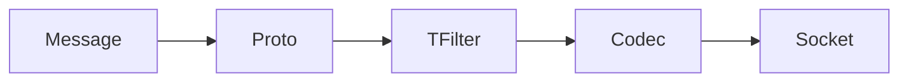

# 传输过滤器(tfilter)
`tfilter`全称`transfer filter`,作用是对要进行网络传输的消息内容`pack`,对读取的消息内容执行`unpack`.

不同于`codec`,`tfilter`可以根据业务需求，按注册顺序执行。

`tfilter`位于`proto`与`codec`之间。



默认支持的传输过滤器(tfilter)

| id  | name | 介绍                     |
|-----|------|------------------------|
| 5   | md5  | 对消息内容进行md5运算，保证消息的完整性  |
| z   | gzip | 对消息内容进行zip压缩，提升消息的传输性能 |
| a   | aes  | 对消息内容使用aes加密，保证消息的安全性  |


## 如何使用传输过滤器

`tfilter`是作用范围是存在于消息层面，每次发送的消息都可以使用不同的过滤器。

使用之前需要注册,注意，注册是全局范围的，作用范围是整个进程。并且一个过滤器只能注册一次。

```go
tfilter.RegMD5()
tfilter.RegGzip(3)
tfilter.RegAES([]byte("1234567890123456"))
```

调用`drpc.WithTFilterPipe`方法来使用`tfilter`:

```go
stat = sess.Call(
    "/main_call/echo",
    str,
    &result,
    drpc.WithTFilterPipe(tfilter.AesId, tfilter.Md5Id, tfilter.GzipId),
).Status()
if !stat.OK() {
    logger.Warning(context.TODO(),stat)
}
```

过滤器的调用顺序按设置顺序执行。

如`drpc.WithTFilterPipe(tfilter.AesId, tfilter.Md5Id, tfilter.GzipId)`
- pack的时候顺序为`aes`,`md5`,`gzip`.
- unpack的时候顺序为`gzip`,`md5`,`aes`.

并非所有`proto`都支持`TFilter`,这个跟协议的实现有关系，目前内置的协议支持情况如下：

| 协议名      | 支持与否    |
|----------|---------|
| raw      | 是       |
| json     | 是       |
| protobuf | 是       |
| http     | 仅支持gzip |
| jsonrpc  | 否       |


## 实现自己的`传输过滤器(tfilter)`

想要实现自己的`tfilter`非常简单，只需要实现`TransferFilter interface`,并且注册就能使用。

```go
// TransferFilter 传输过滤器接口
type TransferFilter interface {
	// ID 过滤器id
	ID() byte
	// Name 过滤器名字
	Name() string
	// OnPack 过滤器打包方法
	OnPack([]byte) ([]byte, error)
	// OnUnpack 过滤器解包方法
	OnUnpack([]byte) ([]byte, error)
}
```

调用`tfilter.Reg()`注册，就能够使用。

具体可以参考代码目录`/drpc/tfilter/aes.go`。
