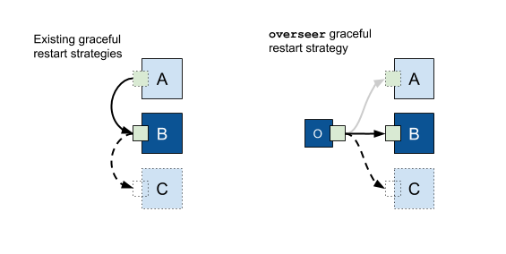
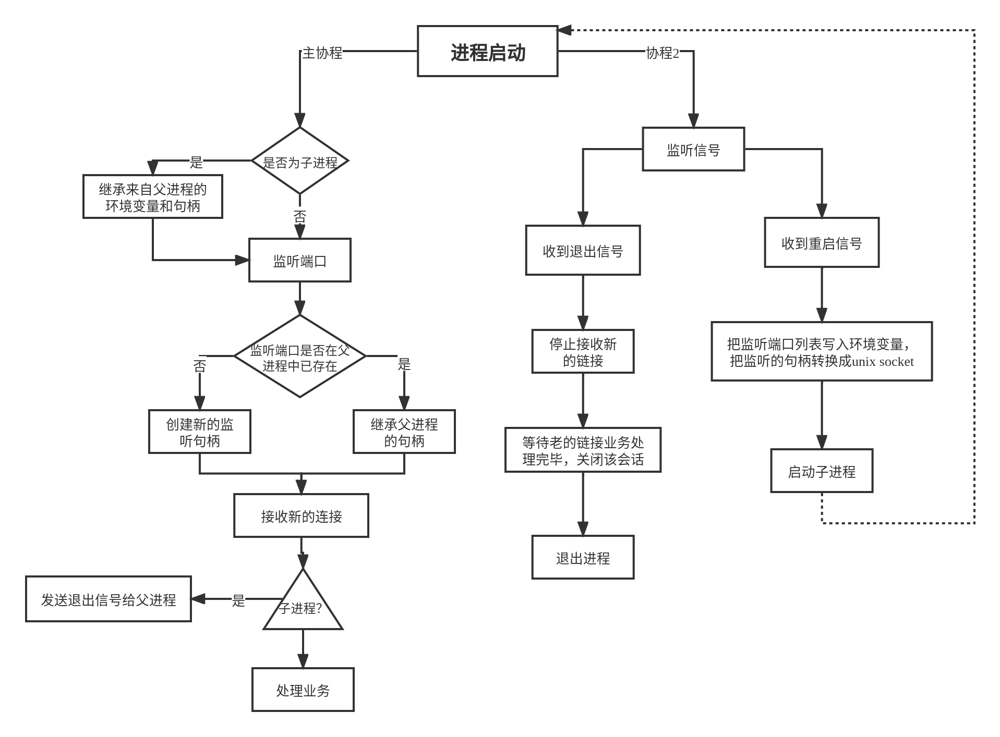

# 平滑重启

## 为什么要平滑重启

在生产环境中发布新版本，一直是一个比较头痛的事情，粗暴的解决方案就是直接重启。
但是直接重启会产生很多问题，特别是在存在大量用户的情况下，问题也会被放大。
不可避免的会出现以下问题：

1. 未处理完的请求，被强制中断，数据一致性被破坏。
2. 在老的服务关闭，新的服务正在启动的期间，请求得不到响应，造成服务中断。

以上两种情况，在使用php的时候，一般是不存在的，但是使用golang，这两个问题就必须自己解决了。

处理发布问题常用的有几种解决方案.

1. 使用网关进行流量切换，把新的流量请求切换到一台正常服务器上，等需要升级的服务没有流量后在重启。
2. 使用`kubernetes`或者其他云平台，进行发布，本质上也是切流量。
3. 程序本身解决流量切换完成平滑重启。

## 什么是平滑重启

进程在不关闭其监听的端口情况下，进行重启，并且在重启的整个过程中保证所有的请求都被正确的处理。

平滑重启有两种实现方式，
1. 父子进程模式。
2. Master - Worker进程模式。



`DRPC`实现了以上两种模式，大家可以根据需要自行选择。


### 单进程模式重启步骤
步骤如下：

1. 新版本的进程发布到线上，并且替换需要执行的进程文件
2. 发送重启信号给到正在运行的进程。
3. 原进程收到信号后，把当前进程监听的`addr`列表赋值给环境变量，然后fork出一个子进程，并使用被替换的可执行进程文件启动。
4. 子进程通过环境变量获得父进程要监听的端口列表，继承父进程所监听的端口。
5. 子进程完成初始化以后，开始接收新的请求。
6. 父进程收到子进程已启动成功的信号后，开始关闭端口监听，并且等待正在处理的请求处理完毕。
7. 所有请求处理完毕，父进程退出。至此，完成了平滑重启。

流程图如下：


> ps: 单进程模式不能在`supervisor`下使用。


### 多进程进程模式重启步骤

步骤如下：
1. `主进程`启动，监听指定的地址，并把`主进程`监听的`addr`列表赋值给环境变量，并fork出一个`子进程A`。
2. `子进程A`通过环境变量获得`主进程`要监听的端口列表，继承`主进程`所监听的端口，完成初始化以后，，开始接收请求。
3. 新版本的进程发布到线上，并且替换需要执行的进程文件
4. 发送重启信号给到正在运行的主进程。
5. `主进程`收到信号后，把`主进程`监听的`addr`列表赋值给环境变量，然后fork出一个`子进程B`，并使用被替换的可执行进程文件启动。
6. `子进程B`通过环境变量获得`主进程`要监听的端口列表，继承`主进程`所监听的端口。
7. `子进程B`完成初始化以后，开始接收新的请求。
8. `主进程`发送退出信号给`子进程A`。
9. 所有请求处理完毕，`子进程A`。至此，完成了平滑重启。

流程图如下：


## 使用方式

### 单进程模式的使用方式

```go
package main

import (
	"fmt"
	"github.com/osgochina/dmicro/drpc"
	"github.com/osgochina/dmicro/dserver"
	"github.com/osgochina/dmicro/logger"
)
func Home(ctx drpc.CallCtx, args *struct{}) (string, *drpc.Status) {
	return "home", nil
}

// DRpcSandBox  默认的服务
type DRpcSandBox struct {
	dserver.BaseSandbox
	endpoint drpc.Endpoint
}

func (that *DRpcSandBox) Name() string {
	return "DRpcSandBox"
}

func (that *DRpcSandBox) Setup() error {
	fmt.Println("DRpcSandBox Setup")
	cfg := that.Config.EndpointConfig(that.Name())
	cfg.ListenPort = 8199
	that.endpoint = drpc.NewEndpoint(cfg)
	that.endpoint.SubRoute("/app").RouteCallFunc(Home)
	return that.endpoint.ListenAndServe()
}

func (that *DRpcSandBox) Shutdown() error {
	fmt.Println("DRpcSandBox Shutdown")
	return that.endpoint.Close()
}

func main() {
	dserver.Authors = "osgochina@gmail.com"
	dserver.SetName("DMicro_drpc")
	dserver.Setup(func(svr *dserver.DServer) {
		err := svr.AddSandBox(new(DRpcSandBox))
		if err != nil {
			logger.Fatal(context.TODO(),err)
		}
	})
}
```

### 多进程进程模式的使用方式

```go
func main() {
	dserver.SetName("DMicro")
	dserver.Setup(func(svr *dserver.DServer) {
		svr.ProcessModel(dserver.ProcessModelMulti)
		svr.SetInheritListener([]dserver.InheritAddr{
			{Network: "tcp", Host: "127.0.0.1", Port: 8199, ServerName: "admin"},
			{Network: "http", Host: "127.0.0.1", Port: 8080, ServerName: "user"},
		})
		err := svr.AddSandBox(new(DRpcSandBox), svr.NewService("admin"))
		if err != nil {
			logger.Fatal(context.TODO(),err)
		}
		err = svr.AddSandBox(new(HttpSandBox), svr.NewService("user"))
		if err != nil {
			logger.Fatal(context.TODO(),err)
		}
	})
}
```
1. 设置多进程模式`svr.ProcessModel(dserver.ProcessModelMulti)`
2. 预先明确需要平滑重启的服务地址和端口`svr.SetInheritListener`
